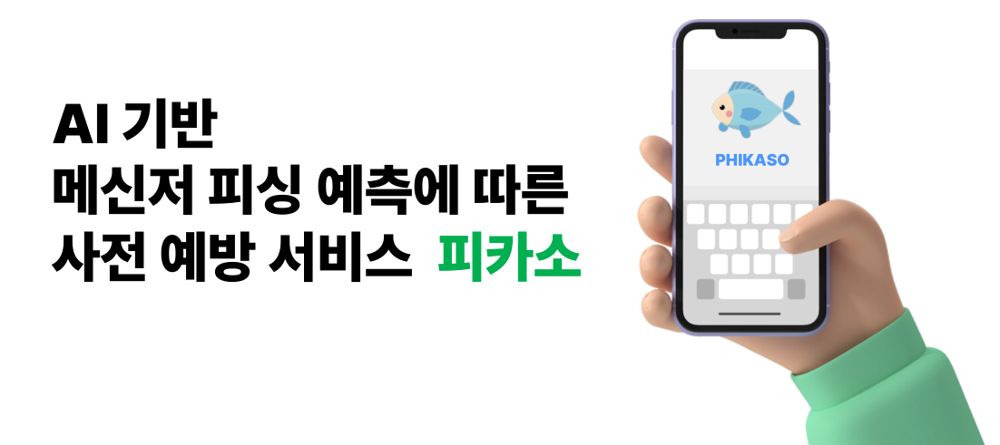
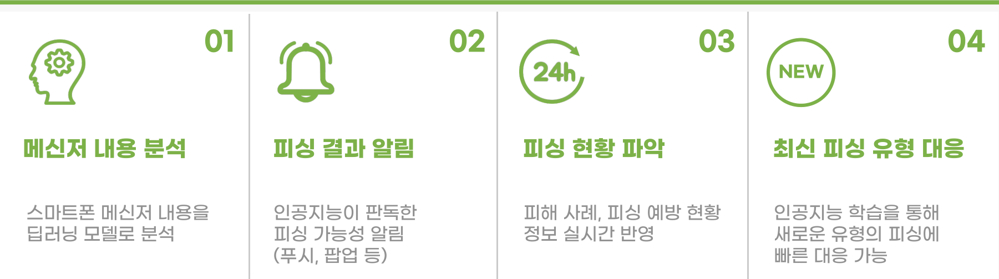
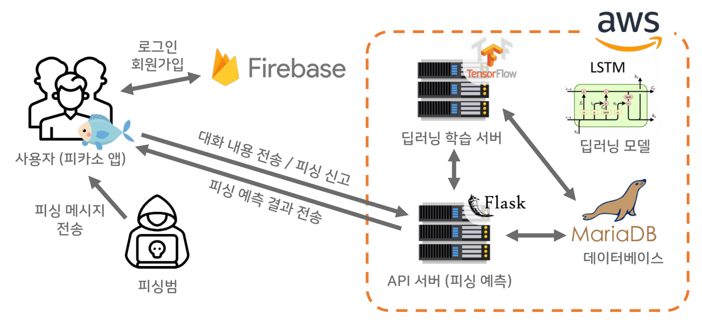
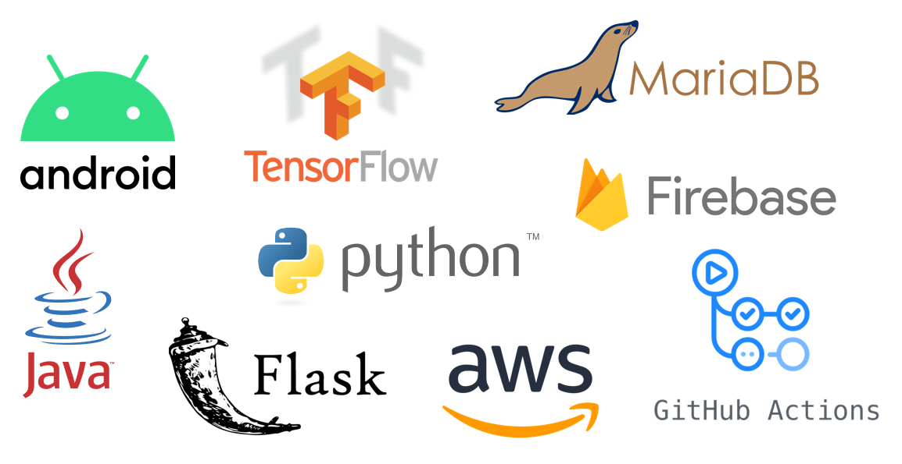
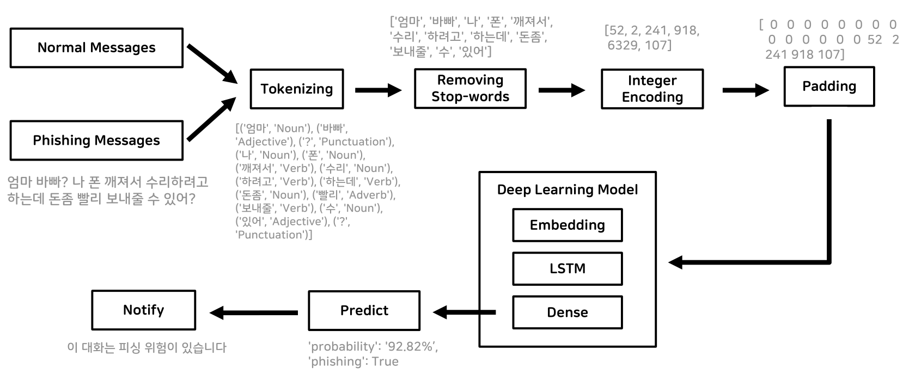

<!-- 
 -->
<!-- 
 -->
<!--   -->
<!-- 대충 가운데 근사한(?) 로고
 -->
<!-- 
 -->
<!-- 
"대충 근사한 캐치프레이즈" AI기반 메신저 피싱 예측에 따른 사전 예방 서비스입니다.
 -->
 
 

## 프로젝트 목표
목표

## 주요 기능
기능

## 서비스 아키텍처

## 사용한 기술 스택

## 기술적 이슈와 해결 과정

## 딥러닝 프로세스

## Coding Convention
+ **Naming Rule**
  + **Class** -> Pascal Case　　　ex) HelloWorld
  + **Method** -> camelCase　　　ex) helloWorld
  + **Variable** -> camelCase　　　ex) helloWorld
   + (Android) button -> snake_case　　　ex) login_btn

