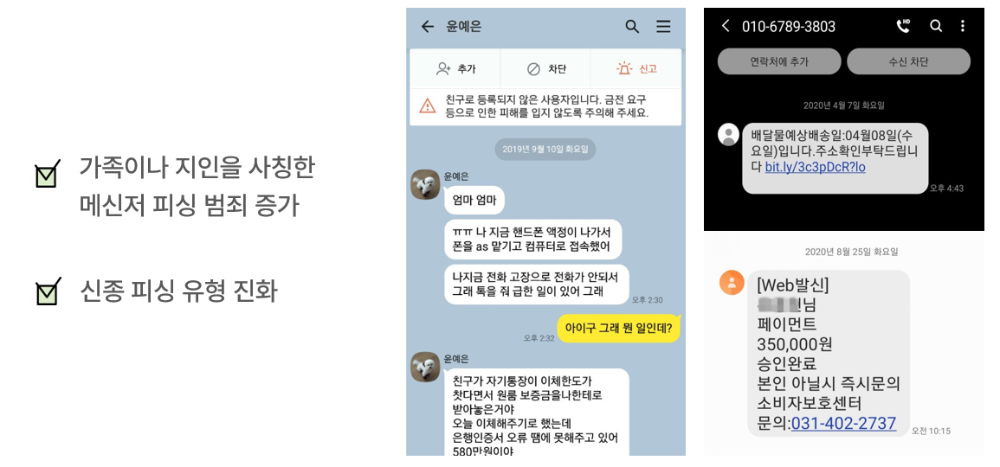

 
 

피카소는 인공지능 기반 메신저 피싱 사전 예방 서비스입니다.
최근 스미싱 피해가 급증하고, 피싱 유형도 다양화되고 있습니다.
또한 문자메시지 이외에 카카오톡과 같은 메신저 피싱도 늘어나는 추세입니다.
따라서 피카소 팀은 메신저 피싱을 예방하고 변화하는 피싱 유형에도 대응할 수 있도록
인공지능 기반 서비스를 개발하였습니다.

## 개발 배경

## 프로젝트 목표

- WHO: 피싱 위험에 노출되어 있는 모든 사용자에게
- WHAT: 피싱 사전 예방 서비스를
- HOW: AI 기반 메신저 피싱 예측 모델을 통해 제공!

## 서비스 아키텍처

## 사용한 기술 스택

## 프로젝트 화면 구성도

## 딥러닝 프로세스

딥러닝 학습을 위해 사용한 데이터:
- 정상 데이터: [AI-Hub: 한국어 SNS](https://aihub.or.kr/aidata/30718)
- 피싱 데이터: 자체 수집 & 설문 조사

<!-- ## Coding Convention -->
<!-- + **Naming Rule** -->
  <!-- + **Class** -> Pascal Case　　　ex) HelloWorld -->
  <!-- + **Method** -> camelCase　　　ex) helloWorld -->
  <!-- + **Variable** -> camelCase　　　ex) helloWorld -->
   <!-- + (Android) button -> snake_case　　　ex) login_btn -->

